# ProCAKE Extension

## Table of Contents

1. [Introduction](#introduction)
2. [SimilarityMeasureFunc, MethodInvoker, MethodInvokersFunc & WeightFunc](#similaritymeasurefunc-methodinvoker-methodinvokersfunc--weightfunc)
6. [ISimilarityMeasureFunc, IMethodInvokersFunc & IWeightFunc](#isimilaritymeasurefunc-imethodinvokersfunc--iweightfunc)
7. [INESTtoList](#inesttolist)
8. [XESBaseToSystemClass](#xesbasetosystemclass)
11. [SimilarityValuatorImplExt](#similarityvaluatorimplext)
9. [RetrieverExt, ParallelLinearRetrieverImplExt & LinearRetrieverImplExt](#retrieverext-parallellinearretrieverimplext--linearretrieverimplext)
10. [Examples](#examples)
12. [Parsing](#parsing)
    - [XML](#xml-to-functional-interface)
      - [Explaination of the DTDs](#parsing)
      - [Differences between the DTDs](#differences-between-the-dtds)
      - [XMLtoFunctionConverter](#xmltofunctionconverter)
      - [Example](#example)
    - [JSON](#json-to-functional-interface)
    - [Boilerplate](#boilerplate)

## Introduction

In ProCAKE 4.0, even though you can define the same similarity
measure for different data classes, that similarity measure will
not be used to compute the similarity between two objects of
these different classes when using a similarity valuator.
A similarity valuator looks for the next common class of the
objects, which has a similarity measure defined for it in the
similarity model and applies that measure.
A similarity valuator is used everytime a retrieval is
performed, thus this issue becomes important for users who
want to use custom and more complicated similarity measures
in their retrieval.
Also, parameters of a similarity measure can only be set
through calling methods of that measure, which is impossible
when using a similarity valuator or a retriever.
Finally, ProCAKE’s predefined similarity measures that work on
collection objects provide no means of applying weights to
their respective elements.
That makes three key issues for which the ProCAKE extension
tries to provide solutions:

1. Computing similarity measure for objects of different
classes.
2. Setting parameters of similarity measures.
3. Using weights for elements of collection objects.

Instead of a `SimilarityValuatorImpl`-object or a
`RetrieverImpl`-object, a `SimilarityValuatorImplExt`- or
`RetrieverImplExt`-object should be used for similarity
computation and retrieval.
The extension is built on the ProCAKE framework without
changing its implementations.
One goal was for the extension to be used as if it was just
the normal framework, that is why every component of the
extension ("…Ext") can be used just like the ProCAKE
counterpart it extends.


***
## SimilarityMeasureFunc, MethodInvoker, MethodInvokersFunc & WeightFunc

### SimilarityMeasureFunc

This functional interface maps a string to a pair of data
objects and is used to define which similarity measure is to
be used for which pairs of data classes.

### MethodInvoker

A `MethodInvoker`-object is used to invoke methods on objects
at runtime using java reflections.

### MethodInvokersFunc

This functional interface maps an ArrayList of
`MethodInvoker`-objects to a pair of data objects.
It is used to set parameters of the similarity measure
defined for the two objects.

### WeightFunc

This functional interface maps a `double` value to a data object .
It can be used to calculate weighed similarity values of
collection objects.

## ISimilarityMeasureFunc, IMethodInvokersFunc & IWeightFunc

If a `SimilarityMeasure` implements one or more of these
interfaces that means that the respective functional
interface can be defined.

## INESTtoList

A simple interface providing a default method for converting
`NESTSequentialWorkflowObject`s to `ListObject`s.
It can be used by similarity measures.

## XESBaseToSystemClass

A 'NESTWorkflow' that has been obtained by using the
**XEStoWorkflowConverter** classes contains TaskNodes which
contain so called `XESEventClass`-objects as semantic descriptors.
These objects are ProCAKE-`AggregateObject`s which can contain
other `AggregateObject`s which all are (ProCAKE-)subclasses of
`XESBaseClass`.
In order to convert these `XESBaseClass`-objects (Java class:
`AggregateObject`, ProCAKE DataClass: `XESBaseClass`!!) to
`de.uni_trier.wi2.procake.data.object.base.CollectionObject`s,
the simple interface `XESBaseToSystemClass` provides a default
method.

The extended similarity measures working on collections implement
this interface and thus also work on these `XESBaseClass`es.

## SimilarityValuatorImplExt

The extension of `SimilarityValuatorImpl` provides means of
setting parameters of the used similarity measure. The
method `public Similarity SimilarityValuatorImplExt.computeSimilarity(DataObject
queryObject, DataObject caseObject, String similarityMeasureStr,
ArrayList<MethodInvoker> methodInvokers)` takes two more
arguments than the one implemented by `SimilarityValuatorImpl`.
The user can now tell the similarity valuator to ignore the
default similarity measure and use the one registered under
the value of `similarityMeasureStr`. An ArrayList of
[MethodInvoker](#methodinvoker)s can be provided in order
to set parameters of the measure.

## RetrieverExt, ParallelLinearRetrieverImplExt & LinearRetrieverImplExt

A `Retriever` needs to implement the `RetrieverExt`
interface in order to be able to apply the above interfaces.
The `LinearRetrieverImplExt` and
`ParallelLinearRetrieverImplExt` are extensions of ProCAKE’s
built-in Retrievers.
They both implement the `RetrieverExt` interface.

A `Retriever` implementing `RetrieverExt` has to define the
following 10 methods
* `public void setGlobalSimilarityMeasure(String similarityMeasure)`
* `public String getGlobalSimilarityMeasure()`
* `public void setGlobalMethodInvokers(ArrayList<MethodInvoker> methodInvokers)`
* `public ArrayList<MethodInvoker> getGlobalMethodInvokers()`
* `public void setLocalSimilarityMeasureFunc(SimilarityMeasureFunc similarityMeasureFunc)`
* `public SimilarityMeasureFunc getLocalSimilarityMeasureFunc()`
* `public void setLocalMethodInvokersFunc(MethodInvokersFunc methodInvokersFunc)`
* `public MethodInvokersFunc getLocalMethodInvokersFunc()`
* `public void setLocalWeightFunc(WeightFunc weightFunc)`
* `public WeightFunc getLocalWeightFunc()`

The global similarity measure is the similarity measure which
is used for similarity computation of the query object and
the case objects in the casebase given to the retriever.
Similarly, the global method invokers are used to set
parameters of the global similarity measure.
The local similarity measure function, method invokers
function, and weight function are used to define
similarity computation for the elements of query and
case objects, if they are collection objects.
***
## Examples

In the following example, after defining query and case
`StringObjects`, a `LinearRetrieverImplExt`-object is
instantiated.
The similarity measure that is to be used on the query and
case objects is `SMStringLevenshtein`, which can be
case-sensitive or insensitive.
To set it to case-insensitive a `MethodInvoker`-object is
instantiated.
The retriever is given a ArrayList containing the
`MethodInvoker` defined above and retrieval is
performed on the query.

````java
CakeInstance.start();

SimilarityMeasureImpl stringLevenshtein = new SMStringLevenshteinImpl();
stringLevenshtein.setDataClass(ModelFactory.getDefaultModel().getStringSystemClass());
SimilarityModelFactory.getDefaultSimilarityModel().addSimilarityMeasure(stringLevenshtein, "StringLevenshtein");

DataObjectUtils utils = new DataObjectUtils();

// query object
StringObject q = utils.createStringObject("Apple");

// case objects
StringObject c0 = utils.createStringObject("Banana");
StringObject c1 = utils.createStringObject("Mango");
StringObject c2 = utils.createStringObject("Pineapple");

// put cases in casebase
WriteableObjectPool objectPool = ObjectPoolFactory.newObjectPool();
objectPool.store(c0);
objectPool.store(c1);
objectPool.store(c2);

// prepare retrieval
LinearRetrieverImplExt linearRetriever = new LinearRetrieverImplExt();
linearRetriever.setObjectPool(objectPool);
linearRetriever.setSimilarityModel(SimilarityModelFactory.getDefaultSimilarityModel());
linearRetriever.setGlobalSimilarityMeasure("StringLevenshtein");

MethodInvoker methodInvoker = new MethodInvoker("setCaseInsensitive", new Class[]{}, new Object[]{});
ArrayList<MethodInvoker> methodInvokerList = new ArrayList<>();
methodInvokerList.add(methodInvoker);

linearRetriever.setGlobalMethodInvokers(methodInvokerList);

// perform retrieval
Query query = linearRetriever.newQuery();
query.setQueryObject(q);
query.setNumberOfResults(3);

RetrievalResultList resultList = linearRetriever.perform(query);
````

Constructing a `MethodInvoker`-object takes three
arguments: 1) A `String` containing the exact name of the
method to be invoked, 2) an array of class objects
and 3) an array of objects while the object’s class
at index i should be the same as the class at index
i in the class array.
The two arrays are used to give arguments to the method.
Since th method `SMStringLevenshtein.setCaseInsensitive()`
does not take arguments the two arrays are empty.

In the next example, two `ListObject`s are created which
contain `StringObject`s.
The global similarity measure is `SMCollectionIsolatedMappingExt`
and the local one is `SMStringLevenshtein`.
In order for the retriever to apply `SMStringLevenshtein` to
`StringObjects`, a `SimilarityMeasureFunc` is defined which
returns the String "StringLevenshtein" if the given
`DataObjects` are both `StringObjects`.
Additionally, a `MethodInvokersFunc` is defined which returns
an ArrayList containing the one `MethodInvoker` from the
example above to set `SMStringLevenshtein` case-insensitive.
That ArrayList is only returned if the `MethodInvokersFunc`
is applied on `StringObject`s.
````java
CakeInstance.start();

SimilarityMeasureImpl stringLevenshtein = new SMStringLevenshteinImpl();
stringLevenshtein.setDataClass(ModelFactory.getDefaultModel().getStringSystemClass());
SimilarityModelFactory.getDefaultSimilarityModel().addSimilarityMeasure(stringLevenshtein, "StringLevenshtein");

SimilarityMeasureImpl collectionIsolatedMapping = new SMCollectionIsolatedMappingImplExt();
collectionIsolatedMapping.setDataClass(ModelFactory.getDefaultModel().getListSystemClass());
SimilarityModelFactory.getDefaultSimilarityModel().addSimilarityMeasure(collectionIsolatedMapping, "CollectionIsolatedMappingExt");

DataObjectUtils utils = new DataObjectUtils();

// query object
StringObject q0 = utils.createStringObject("Lemon");
StringObject q1 = utils.createStringObject("Apple");
StringObject q2 = utils.createStringObject("Orange");
ListObject q = utils.createListObject();
q.addValue(q0);
q.addValue(q1);
q.addValue(q2);

// case objects
StringObject c00 = utils.createStringObject("Banana");
StringObject c01 = utils.createStringObject("Pineapple");
StringObject c02 = utils.createStringObject("Kiwi");
ListObject c0 = utils.createListObject();
c0.addValue(c00);
c0.addValue(c01);
c0.addValue(c02);

StringObject c10 = utils.createStringObject("Melon");
StringObject c11 = utils.createStringObject("Mango");
StringObject c12 = utils.createStringObject("Pear");
ListObject c1 = utils.createListObject();
c1.addValue(c10);
c1.addValue(c11);
c1.addValue(c12);

// put cases in casebase
WriteableObjectPool objectPool = ObjectPoolFactory.newObjectPool();
objectPool.store(c0);
objectPool.store(c1);

// prepare retrieval
SimilarityMeasureFunc localSimilarityMeasureFunc = new SimilarityMeasureFunc() {
    @Override
    public String apply(DataObject q, DataObject c) {
        if (q.getDataClass().isString() && c.getDataClass().isString()) return "StringLevenshtein";
        return null;
    }
};

MethodInvokersFunc localMethodInvokersFunc = new MethodInvokersFunc() {
    @Override
    public ArrayList<MethodInvoker> apply(DataObject q, DataObject c) {
        if (q.getDataClass().isString() && c.getDataClass().isString()) {
            MethodInvoker methodInvoker = new MethodInvoker("setCaseInsensitive", new Class[]{}, new Object[]{});
            ArrayList<MethodInvoker> methodInvokerList = new ArrayList<>();
            methodInvokerList.add(methodInvoker);
            return methodInvokerList;
        }
        return null;
    }
};

LinearRetrieverImplExt linearRetriever = new LinearRetrieverImplExt();
linearRetriever.setSimilarityModel(SimilarityModelFactory.getDefaultSimilarityModel());
linearRetriever.setGlobalSimilarityMeasure("CollectionIsolatedMappingExt");
linearRetriever.setLocalSimilarityMeasureFunc(localSimilarityMeasureFunc);
linearRetriever.setLocalMethodInvokersFunc(localMethodInvokersFunc);

linearRetriever.setObjectPool(objectPool);

Query query = linearRetriever.newQuery();
query.setQueryObject(q);
query.setNumberOfResults(2);
query.setRetrieveCases(true);

// perform retrieval
RetrievalResultList resultList = linearRetriever.perform(query);
````
In this final example we have one query and two case `ListObject`s
containing the same three `StringObject`s "Lemon", "Apple" & "Orange",
but in different orders.
For such lists the ``SMListCorrectnessImplExt`` measure can be
used.

At first, only the global similarity measure is set and
retrieval is performed on the query and case objects.

Then, additionally, the global method invokers of the retriever
are set. They contain one `MethodInvoker`for setting the
discordant parameter of the `SMListCorrectnessImplExt` measure
to 0.5. After that, retrieval is performed again.

Finally, a `WeightFunc` is defined which returnes a value of
0.5 for `StringObject`s whose value is "Apple" and 1.0 for
everything else. The retrievers local weight function is set
and retrieval is performed.
````java
CakeInstance.start();

SimilarityMeasureImpl stringLevenshtein = new SMStringLevenshteinImpl();
stringLevenshtein.setDataClass(ModelFactory.getDefaultModel().getStringSystemClass());
SimilarityModelFactory.getDefaultSimilarityModel().addSimilarityMeasure(stringLevenshtein, "StringLevenshtein");

SimilarityMeasureImpl collectionIsolatedMapping = new SMCollectionIsolatedMappingImplExt();
collectionIsolatedMapping.setDataClass(ModelFactory.getDefaultModel().getListSystemClass());
SimilarityModelFactory.getDefaultSimilarityModel().addSimilarityMeasure(collectionIsolatedMapping, "CollectionIsolatedMappingExt");

SimilarityMeasureImpl listCorrectness = new SMListCorrectnessImplExt();
listCorrectness.setDataClass(ModelFactory.getDefaultModel().getListSystemClass());
SimilarityModelFactory.getDefaultSimilarityModel().addSimilarityMeasure(listCorrectness, "ListCorrectnessExt");

DataObjectUtils utils = new DataObjectUtils();

// query object
StringObject q0 = utils.createStringObject("Lemon");
StringObject q1 = utils.createStringObject("Apple");
StringObject q2 = utils.createStringObject("Orange");
ListObject q = utils.createListObject();
q.addValue(q0);
q.addValue(q1);
q.addValue(q2);

// case objects
StringObject c00 = utils.createStringObject("Orange");
StringObject c01 = utils.createStringObject("Apple");
StringObject c02 = utils.createStringObject("Lemon");
ListObject c0 = utils.createListObject();
c0.addValue(c00);
c0.addValue(c01);
c0.addValue(c02);

StringObject c10 = utils.createStringObject("Apple");
StringObject c11 = utils.createStringObject("Lemon");
StringObject c12 = utils.createStringObject("Orange");
ListObject c1 = utils.createListObject();
c1.addValue(c10);
c1.addValue(c11);
c1.addValue(c12);

// put cases in casebase
WriteableObjectPool objectPool = ObjectPoolFactory.newObjectPool();
objectPool.store(c0);
objectPool.store(c1);

// prepare retrieval
LinearRetrieverImplExt linearRetriever = new LinearRetrieverImplExt();
linearRetriever.setSimilarityModel(SimilarityModelFactory.getDefaultSimilarityModel());
linearRetriever.setGlobalSimilarityMeasure("ListCorrectnessExt");

linearRetriever.setObjectPool(objectPool);

Query query = linearRetriever.newQuery();
query.setQueryObject(q);
query.setNumberOfResults(2);
query.setRetrieveCases(true);

// perform retrieval
RetrievalResultList resultList = linearRetriever.perform(query);
System.out.println(resultList);

ArrayList<MethodInvoker> globalMethodInvokers = new ArrayList<>();
globalMethodInvokers.add(new MethodInvoker("setDiscordantParameter", new Class[]{double.class}, new Object[]{0.5}));
linearRetriever.setGlobalMethodInvokers(globalMethodInvokers);

resultList = linearRetriever.perform(query);
System.out.println(resultList);

WeightFunc localWeightFunc = new WeightFunc() {
    @Override
    public double apply(DataObject q) {
        if (!q.getDataClass().isString()) return 1;
        StringObject qString = (StringObject) q;
        if (qString.getNativeString().equals("Apple")) return 0;
        return 1;
    }
};
linearRetriever.setLocalWeightFunc(localWeightFunc);

resultList = linearRetriever.perform(query);
System.out.println(resultList);
````
The output is:
````text
2 element(s){hashmappool3::0=1.0,hashmappool3::1=0.3333333333333333}
2 element(s){hashmappool3::0=0.5,hashmappool3::1=0.3333333333333333}
2 element(s){hashmappool3::1=1.0,hashmappool3::0=0.5}
````
As table:

| Run | sim(q,c0) | sim(q,c1) |
|-----|-----------|-----------|
| 1   | 1         | 1/3       |
| 2   | 1/2       | 1/3       |
| 3   | 1/2       | 1         |

So as one can see the the setting of a parameter or
providing a weight function can have influence on the results
of a retrieval

## Parsing

In order to communicate with a ProCAKE instance per an API,
a way of transporting functional interfaces without having to
use java code had to be found.
This has been achieved by turning Java code into an XML or JSON format.
For the three central functional interfaces of this extension
([SimilarityMeasureFunc, MethodInvokersFunc, WeightFunc](#similaritymeasurefunc-methodinvoker-methodinvokersfunc--weightfunc))
Document Type Definitions (.dtd) and JSON Schemas (.jschema)
have been defined to schematize
these Java-like XML formats. The DTD and JSchema files can be
found under
`src/main/resources/de/uni_trier/wi2/dtd` and
`src/main/resources/de/uni_trier/wi2/jschema` or at
https://karim-amri.de/dtd/ or https://karim-amri.de/jschema/. I will first explain the XML
components on the example of `methodinvokers-function.dtd`:

### XML to Functional Interface
The root element in this case is the `<method-invokers-function>`
element, which can contain an arbitrary amount of `<if>`
elements. An if-statement in Java consists of a condition and
a body which contains the instructions. However, the only
instruction we want to give is to `return` an
`ArrayList<MethodInvoker>`. That is why an `<if>` element has
to contain exactly one of the following elements as first child:
1. `<and>`,
2. `<or>`,
3. `<not>`,
4. `<equals>`,
5. `<same-object-as>`,
6. `<instance-of>`, or
7. `<regex>`,

which all may represent the condition.
And the second child element of an `<if>` element has to be
a `<method-list>` element which represents the
`ArrayList<MethodInvoker>`.
I will discuss the 'condition elements' at first.

In more detail, the 'condition elements' represent
Java-operators/functions which return a boolean value.
`<and>`, `<or>` & `<not>` represent
`&&`, `||` & `!`. `<equals>` represents `boolean Object.equals(Object obj)`
while `<same-object-as>` represents the `==`operator.
`<instance-of>` represents the `instanceof`operator and
`<regex>` represents a test if a String matches a regular
expression.

Since `<and>`, `<or>` & `<not>` represent boolean operators, their
child elements, which represent the operands, should represent
something that returns a boolean value itself.
That is why `<and>` and `<or>` must have **at least two** and
`<not>` **exactly one** of the 'condition elements' as
child element(s).

The operands of `<equals>` & `<same-object-as>` are objects, which
is why their child elements are exactly two of the following:
1. `<q>`,
2. `<c>`,
4. `<string>`,
5. `<double>`,
6. `<boolean>`,
7. `<character>`,
8. `<integer>`, and
9. `<method-return-value>`,

which represent just that: an object. I will adress these
'object elements' later.

The operands of the `instanceof` operator are objects, as well,
but it does not make sense to check if a `double` is an instance
of a `String` for example. That is why the child elements of
the `<instance-of>` element are just `<q>`, `<c>` &
`<method-return-value>`.

`<regex>` needs two `<string>` elements as children of course:
1. The regular expression and
2. the String to be matched.

But since `String` objects can be return-values of methods, a
`<method-return-value>` element is allowed instead of a
`<string>` element, as well.
Keep in mind that the order of children plays a role here!

Let's talk about the 'object elements' mentioned above.
Since we're always talking about query and case objects on
which a retrieval or a similarity measuring has to be
performed, there are `<q>` and `<c>`elements representing
the query and case object, respectively.
These elements are empty and have no attributes.

The `<string>`, `<double>`, `<boolean>`, `<character>`,
& `<integer>` elements are all empty
but have one required attribute called `value`, which,
you guessed it, stores the value of the `String`, `Double`,
`Boolean`, `Character`, or `Integer` object.

As you might have also guessed, a `<method-return-value>` element
represents the return-value of a method, which in turn is
represented by a `<method>` element.
The `<method-return-value>` element requires a `<q>`, `<c>`,
or `<method-return-value>` element as first and a `<method>`
element as a second child.
The first child represents the object of which the method
represented by the second child is called.

A `<method>` has a required attribute `name`, which contains
the exact name of the method without modifiers or parameters.
It can have an arbitrary amount of `<string>`, `<double>`,
`<boolean>`, `<character>`, & `<integer>` elements
as children which represent the arguments of the method.

A `<method-list>` element contains an arbitrary amount
of `<method>` child elements and represents a list of methods.

Note, that **the order of `<if>` elements in the XML is also
the order of the if-statements in the converted function!**
That means, that one can produce a virtual else-statement in
just defining another `<if>` element **directly after** the
first one and defining the first child element as 
`<equals><q/><q/></equals>`, for example.

Also, if none of the `<if>` elements' conditions were satisfied,
a default value is returned as follows:

#### Differences between the DTDs
##### Default value:
- `methodinvokers-function.dtd`: Empty `ArrayList<MethodInvoker>`
- `similaritymeasure-function.dtd`: `null`
- `weight-function.dtd`: a `double` with the value `1`
##### Name of root element:
- `methodinvokers-function.dtd`: `<method-invokers-function>`
- `similaritymeasure-function.dtd`: `<similarity-measure-function>`
- `weight-function.dtd`: `<weight-function>`
##### Second child of `<if>` Element.
- `methodinvokers-function.dtd`: `<method-list>`
- `similaritymeasure-function.dtd`: `<string>`
- `weight-function.dtd`: `<double>`

The second child of the `<if>` element always represents the
return value of the respective functional interface.
##### Availability of `<c>` element.
- `methodinvokers-function.dtd`: yes
- `similaritymeasure-function.dtd`: yes
- `weight-function.dtd`: no

Since `WeightFunc.apply(DataObject q)` takes only one argument,
there is no need for the `<c>` element to exist in that DTD.

#### XMLtoFunctionConverter

The three inheritors of the abstract class `XMLtoFunctionConverter`
- `XMLtoMethodInvokersFuncConverter`,
- `XMLtoSimilarityMeasureFuncConverter`, and
- `XMLtoWeightFuncConverter`

implement the functions
- `public static MethodInvokersFunc getMethodInvokersFunc(String str)`,
- `public static SimilarityMeasureFunc getSimilarityMeasureFunc(String str)`, and 
- `public static WeightFunc getSimilarityMeasureFunc(String str)`

respectively, as well as the same functions but taking a `File`
object as an argument.

These functions convert a given XML file/string to the
respective object. The XML should be valid against the respective
DTD, of course.
It is necessary that the `<!DOCTYPE ...` tag is given. Use
the URL https://karim-amri.de/dtd/ if you want to avoid errors
(see example below).

#### Example
Take a look at the following XML
`src/test/resources/de/uni_trier/wi2/xml/weight-function-test.xml`:
```xml
<?xml version="1.0" encoding="UTF-8"?>
<!DOCTYPE weight-function SYSTEM "https://karim-amri.de/dtd/weight-function.dtd">
<weight-function>
    <if>
        <or>
            <and>
                <instance-of>
                    <q/>
                    <string value="de.uni_trier.wi2.procake.data.object.base.IntegerObject"/>
                </instance-of>
                <equals>
                    <double value="2"/>
                    <method-return-value>
                        <q/>
                        <method name="getNativeInteger"/>
                    </method-return-value>
                </equals>
            </and>
            <and>
                <instance-of>
                    <q/>
                    <string value="de.uni_trier.wi2.procake.data.object.base.BooleanObject"/>
                </instance-of>
                <not>
                    <same-object-as>
                        <boolean value="false"/>
                        <method-return-value>
                            <q/>
                            <method name="getNativeBoolean"/>
                        </method-return-value>
                    </same-object-as>
                </not>
            </and>
        </or>
        <double value="0.3"/>
    </if>
    <if>
        <and>
            <instance-of>
                <q/>
                <string value="de.uni_trier.wi2.procake.data.object.base.StringObject"/>
            </instance-of>
            <regex>
                <string value="ab(c)*d"/>
                <method-return-value>
                    <q/>
                    <method name="getNativeString"/>
                </method-return-value>
            </regex>
        </and>
        <double value="0.4"/>
    </if>
</weight-function>
```
Applying `XMLtoWeightFuncConverter.getWeightFunc(String str)`
on this would be the same as defining a `WeightFunc` as follows:
```java
WeightFunc weighTFunc = new WeightFunc() {
    @Override
    public ArrayList<MethodInvoker> apply(DataObject q) {
        if (
                    ((q instanceof IntegerObject) && (((IntegerObject) q).getNativeInteger().equals(2d)))
                ||  ((q instanceof BooleanObject) && !(((BooleanObject) q).getNativeBoolean() == false))
        ) {
            return 0.3d;
        }
        if (
                    (q instanceof StringObject) 
                &&  (Pattern.compile("ab(c)*d").matcher( q.getNativeString() ).matches())
        ) {
            return 0.4d;
        }
        return 1d;
    }
};
```

### JSON to Functional Interface
The basic structures of an XML and a JSON representation are
pretty similar. Every one of the above explained tags
is available as a JSON object, but every object has to have
an `element-type` property, which is a __string property__.
The value of this property has to be the type of the object
it belongs to, which can be:

* `similarity-measure-function`
* `method-invokers-function`
* `weight-function`
* `if`
* `and`
* `or`
* `not`
* `equals`
* `same-object-as`
* `instance-of`
* `regex`
* `q`
* `c`
* `string`
* `double`
* `boolean`
* `character`
* `integer`
* `method`
* `method-return-value`
* `method-list`

This is necessary so that the parser knows what kind of object
it is dealing with.

The root object is an object where `element-type` is one of
`similarity-measure-function`, `method-invokers-function`,
or`weight-function`. Also, if a non-trivial functional interface
(always returning a default value) is to be constructed,
a property `if-statements` of type __array__ has to be declared.
Content of that array can only be __Objects__ of `element-type`
`if`.

#### Example
This example at
`src/test/resources/de/uni_trier/wi2/json/weight-function-test.json`,
 represents the same `WeightFunc` as the XML example above:
```json
{
  "element-type": "weight-function",
  "if-statements": [
    {
      "element-type": "if",
      "condition": {
        "element-type": "or",
        "content": [
          {
            "element-type": "and",
            "content": [
              {
                "element-type": "instance-of",
                "a": {
                  "element-type": "q"
                },
                "b": {
                  "element-type": "string",
                  "value": "de.uni_trier.wi2.procake.data.object.base.IntegerObject"
                }
              },
              {
                "element-type": "equals",
                "a": {
                  "element-type": "double",
                  "value": 2
                },
                "b": {
                  "element-type": "method-return-value",
                  "object": {
                    "element-type": "q"
                  },
                  "method": {
                    "element-type": "method",
                    "name": "getNativeInteger"
                  }
                }
              }
            ]
          },
          {
            "element-type": "and",
            "content": [
              {
                "element-type": "instance-of",
                "a": {
                  "element-type": "q"
                },
                "b": {
                  "element-type": "string",
                  "value": "de.uni_trier.wi2.procake.data.object.base.BooleanObject"
                }
              },
              {
                "element-type": "not",
                "content": {
                  "element-type": "same-object-as",
                  "a": {
                    "element-type": "boolean",
                    "value": "false"
                  },
                  "b": {
                    "element-type": "method-return-value",
                    "object": {
                      "element-type": "q"
                    },
                    "method": {
                      "element-type": "method",
                      "name": "getNativeBoolean"
                    }
                  }
                }
              }
            ]
          }
        ]
      },
      "return-value": {
        "element-type": "double",
        "value": 0.3
      }
    },
    {
      "element-type": "if",
      "condition": {
        "element-type": "and",
        "content": [
          {
            "element-type": "instance-of",
            "a": {
              "element-type": "q"
            },
            "b": {
              "element-type": "string",
              "value": "de.uni_trier.wi2.procake.data.object.base.StringObject"
            }
          },
          {
            "element-type": "regex",
            "pattern": {
              "element-type": "string",
              "value": "ab(c)*d"
            },
            "matcher": {
              "element-type": "method-return-value",
              "object": {
                "element-type": "q"
              },
              "method": {
                "element-type": "method",
                "name": "getNativeString"
              }
            }
          }
        ]
      },
      "return-value": {
        "element-type": "double",
        "value": 0.4
      }
    }
  ]
}
```

The only differences between the XML and JSON representations
are grammatical and syntactical, which is
why I will not describe the JSON schemas further.
If you feel stuck in trying to understand these DTDs or
schemas, take a look at the concepts of DTD and JSON schema
themselves to understand why certain keywords are chosen
they way they are and take a look at the `evaluate`- and
`get...Func`-methods of XMLtoFunctionConverter and
JSONtoFunctionConverter respectively. Also, take a look at the
examples in `src/test/resources/de/uni_trier/wi2/xml`
and `src/test/resources/de/uni_trier/wi2/json` respectively.

### Boilerplate
Here are some boilerplate snippets for possible use cases:
1. [q and c both have DataClass "XYZ"](#q-and-c-both-have-procake-class-xyz)
2. [q and c are StringObjects](#q-and-c-are-stringobjects)
3. [Always return certain value](#always-return-certain-value)

#### q and c both have ProCake-class "XYZ"
__Java__
```Java
String dataClassQ = q.getDataClass().getName();
String dataClassC = c.getDataClass().getName();
if (dataClassQ.equals(dataClassC) && dataClassQ.equals("XYZ")) {
    return ...
}
```

__XML__
```XML
<if>
    <and>
        <equals>
            <method-return-value>
                <method-return-value>
                    <q/>
                    <method name="getDataClass"/>
                </method-return-value>
                <method name="getName"/>
            </method-return-value>
            <method-return-value>
                <method-return-value>
                    <c/>
                    <method name="getDataClass"/>
                </method-return-value>
                <method name="getName"/>
            </method-return-value>
        </equals>
        <equals>
            <method-return-value>
                <method-return-value>
                    <q/>
                    <method name="getDataClass"/>
                </method-return-value>
                <method name="getName"/>
            </method-return-value>
            <string value="XYZ"/>
        </equals>
    </and>
    ...
</if>
```

__JSON__
```JSON
{
  "element-type": "if",
  "condition": {
    "element-type": "and",
    "content": [
      {
        "element-type":  "equals",
        "a": {
          "element-type": "method-return-value",
          "object": {
            "element-type": "method-return-value",
            "object": {
              "element-type": "q"
            },
            "method": {
              "element-type": "method",
              "name": "getDataClass"
            }
          },
          "method": {
            "element-type": "method",
            "name": "getName"
          }
        },
        "b": {
          "element-type": "method-return-value",
          "object": {
            "element-type": "method-return-value",
            "object": {
              "element-type": "c"
            },
            "method": {
              "element-type": "method",
              "name": "getDataClass"
            }
          },
          "method": {
            "element-type": "method",
            "name": "getName"
          }
        }
      },
      {
        "element-type": "equals",
        "a": {
          "element-type": "method-return-value",
          "object": {
            "element-type": "method-return-value",
            "object": {
              "element-type": "q"
            },
            "method": {
              "element-type": "method",
              "name": "getDataClass"
            }
          },
          "method": {
            "element-type": "method",
            "name": "getName"
          }
        },
        "b": {
          "element-type": "string",
          "value": "XYZ"
        }
      }
    ]
  },
  "return-value": { ... }
}
```


#### q and c are StringObjects
__Java__
```Java
if (q instanceof StringObject && c instanceof StringObject){
    return ...
}
```

__XML__
```XML
<if>
    <and>
        <instance-of>
            <q/>
            <string value="StringObject"/>
        </instance-of>
        <instance-of>
            <c/>
            <string value="StringObject"/>
        </instance-of>
    </and>
    ...
</if>
```

__JSON__
```JSON
{
  "element-type": "if",
  "condition": {
    "element-type": "and",
    "content": [
      {
        "element-type": "instance-of",
        "a": {
          "element-type": "q"
        },
        "b": {
          "element-type": "string",
          "value": "StringObject"
        }
      },
      {
        "element-type": "instance-of",
        "a": {
          "element-type": "c"
        },
        "b": {
          "element-type": "string",
          "value": "StringObject"
        }
      }
    ]
  },
  "return-value": { ... }
}
```

#### Always return certain value
__Java__
```Java
return ...
```

__XML__
```XML
<if>
    <equals>
        <q/>
        <q/>
    </equals>
    ...
</if>
```

__JSON__
```JSON
{
  "element-type": "if",
  "return-value": { ... }
}
```
No condition means `true` here!

```mermaid
---
title: Class Diagram of Components used by Functional Interface Converters
---
classDiagram
    
    class AndComponent{
        -LogicalOrConditionComponent[] conditions
    }

    class NotComponent{
        -LogicalOrConditionComponent condition
    }

    class OrComponent{
        -LogicalOrConditionComponent[] conditions
    }
    
    class EqualsComponent{
        -ObjectOrValueComponent object1
        -ObjectOrValueComponent object2
    }
    
    class InstanceOfComponent{
        -ObjectComponent object
        -StringComponent stringC
    }
    
    class RegexComponent{
        -StringOrMethodReturnValueComponent pattern
        -StringOrMethodReturnValueComponent string
    }
    
    class SameObjectAsComponent{
        -ObjectOrValueComponent object1
        -ObjectOrValueComponent object2
    }
    
    class BooleanComponent{
        -Boolean value
    }
    
    class CharacterComponent{
        -Character value
    }

    class DoubleComponent{
        -Double value
    }

    class IntegerComponent{
        -Integer value
    }

    class StringComponent{
        -String value
    }
    
    class CComponent
    
    class QComponent
    
    class MethodComponent{
        -ValueComponent[] arguments
        -String name
    }
    
    class MethodListComponent{
        -MethodComponent[] methods
        + ArrayList<MethodInvoker> evaluate()
    }

    class MethodReturnValueComponent{
        -ObjectComponent object
        -MethodComponent method
    }


    class FunctionComponent{
        -String name
        -String firstArgument
        -String secondArgument
    }


    class IfComponent{
        <<abstract>>
        -LogicalOrConditionComponent conditionComponent
        + boolean isSatisfied(DataObject, DataObject )
    }

    class MIF_IfComponent{
        -MethodListComponent methodList
    }

    class SMF_IfComponent{
        -StringComponent string
    }

    class WF_IfComponent{
        -DoubleComponent doubleComponent
    }
    
    
    class Component{
        <<interface>>
        + T evaluate(DataObject, DataObject)
    }
    
    class ConditionComponent{
        <<interface>>
    }
    
    class LogicalComponent{
        <<interface>>
    }
    
    class LogicalOrConditionComponent{
        <<interface>>
        + Boolean evaluate(DataObject, DataObject)
    }
    
    class ObjectComponent{
        <<interface>>
    }
    
    class ObjectOrValueComponent{
        <<interface>>
    }
    
    class StringOrMethodReturnValueComponent{
        <<interface>>
    }
    
    class ValueComponent{
        <<interface>>
        + T evaluate()
    }
    
    
    
    
    
    
    
    LogicalComponent <|-- AndComponent
    LogicalComponent <|-- NotComponent
    LogicalComponent <|-- OrComponent
    
    ConditionComponent <|-- EqualsComponent
    ConditionComponent <|-- InstanceOfComponent
    ConditionComponent <|-- RegexComponent
    ConditionComponent <|-- SameObjectAsComponent
    
    ValueComponent <|-- BooleanComponent
    ValueComponent <|-- CharacterComponent
    ValueComponent <|-- DoubleComponent
    ValueComponent <|-- IntegerComponent
    ValueComponent <|-- StringComponent
    
    ObjectComponent <|-- CComponent
    ObjectComponent <|-- QComponent
    
    Component <|-- MethodComponent
    Component <|-- MethodListComponent
    ObjectComponent <|-- MethodReturnValueComponent
    StringOrMethodReturnValueComponent <|-- MethodReturnValueComponent

    ObjectComponent <|-- FunctionComponent
    StringOrMethodReturnValueComponent <|-- FunctionComponent
    
    IfComponent <|-- MIF_IfComponent
    IfComponent <|-- SMF_IfComponent
    IfComponent <|-- WF_IfComponent

    LogicalOrConditionComponent <|-- ConditionComponent
    LogicalOrConditionComponent <|-- LogicalComponent
    Component <|-- LogicalOrConditionComponent
    ObjectOrValueComponent <|-- ObjectComponent
    Component <|-- ObjectOrValueComponent
    Component <|-- StringOrMethodReturnValueComponent
    ObjectOrValueComponent <|-- ValueComponent
    
    

```


